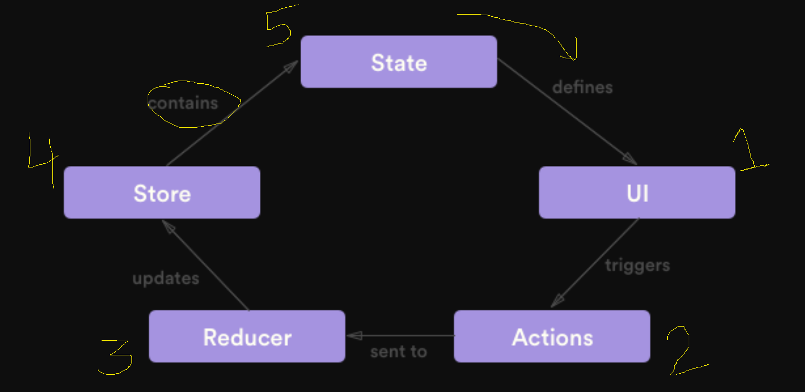

1) Github Pricing:-

https://github.com/pricing#feature-comparison


2) Stack:-

> Push Item  (git stash ===> push changes) , (shelveset in terms of TFS)
> Pop Item   (git stash pop ===> pop latest stash)

3) There are differences between:-
> Convert Artifi Admin into a full fledge react web application from scratch (npx create-react-app new-artifi-admin --template typescript)

and

> Rendering some part of Admin/UI using React (This is what we are doing in headless artifi project) (webpack or bundlers, come into play here)


4) Create a new react project using typescript:-
npx create-react-app artifi-admin-components --template typescript

5) You have application:-

	a) written in ASP.Net
	b) One component written in React 
	
	So, you'll need an identifier for that react component so that you can access it in .Net.
	
	To create a React component and access it with a global namespace/identifier, we bundle it using a bundler like webpack. Webpack comes with lot of 
	other benefits like:-
	
	a) Bundle Size Optimization
	b) Static Assets Optimization
	c) Conflict Avoidance
	
6) To configure Webpack, we need some required dependencies:-
	
	a) webpack  (Core API of webpack)
	b) webpack-cli  (CLI of webpack)
	
7) NPM Dependencies:-
	
	a) dependencies ==> These are dependencies which are directly or indirectly being used in out source code
	b) devDependencies ==> These dependencies are used in development purpose only, (don't go in production)

	webpack => create bundles from your actual source code

	webpack ==> npm install -D webpack   OR   npm i --save-dev webpack
	webpack-cli ==> npm install -D webpack-cli   OR   npm i --save-dev webpack-cli


NPM install in-depth:-
https://docs.npmjs.com/cli/v6/commands/npm-install


8) Configure Webpack:-

	a) npm install -D webpack webpack-cli
	b) Populate webpack.config.js (Just like you have web.config in .Net for Application Settings & IIS)
		This is a webpack configuration file
	
	webpack is a node package, not a browser package like jquery which can be accessed directly from browser.
	

9) Under "scripts" in package.json, you can define as many custom scripts as you want.

10) Webpack comes with lot of loaders and plugins to handle different types of files.

11) Webpack handles .js files by default, but to handle/parse ts or tsx files, you need to install a loader called ts-loader

12) TS7016: Could not find a declaran file for module 'react'.  

We fixed this error by setting noEmit to false in tsconfig.json


a = 1

b = a

fullName = firstName + ' ' + lastName


To use JavaScript/TypeScript variable or syntax in JSX, you need to enclose them inside `{}`

## How to Edit last commit message:

git commit --amend


## Component Rendering Troubleshooting
We shouldn't update the state from the render method. It will render component infinite times.

# Redux
-----------------------------------

It is used to manage complex data of an application using state management

It is not required to use redux in all react applications. It depends on how complex your application is and how do you want to manage your data in it.



# Steps to implement Redux in React Application

1. Install redux dependencies:-

```
npm install redux react-redux
```

For typescript, install type definition files as well:-

```
npm install -D @types/redux @types/react-redux
```

2. Create a Redux store

```typescript
import {createStore} from 'redux';
const store = createStore(<your-reducer>);
```

3. Create a reducer

Reducer is a function which accepts state and action, as parameters.

Redux function must return the immutable state.

```typescript
const reducer = (state, action) => {
    return {...state};
};
```

4. Encapsulate UI with Redux provider

```html

<Provider store={<instance-of-store>}>
	<Your-React-Component>
	</Your-React-Component>
</Provider>

```

5. Install redux-devtools-extension to debug redux state

```
npm install --save redux-devtools-extension
```


### **Note:**  A file can have multiple named exports but only one default export